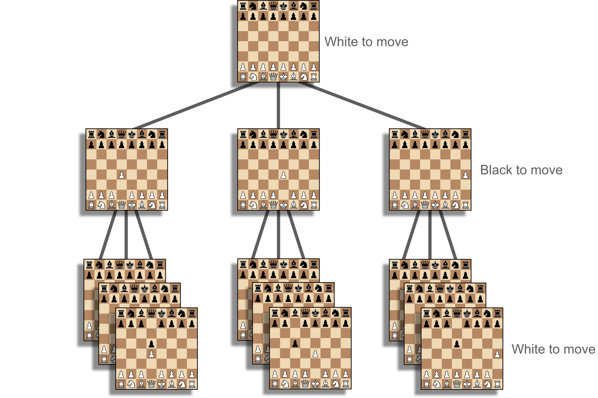

# What humans used to think of us back then.

We want to build systems to automate various tasks (breaking cyphers, playing Chess against us, do our homework for us, self-drive cars, etc). Alan Turing addressed some of those tasks with electro-mechanical machines.

<figure style="width:60%">
    
    <figcaption>Bombe machine (electro-mechanical)</figcaption>
</figure>

Fast forward to these days, we tackle those with transistor-based digital computers, software, and **algorithms**. Algorithms were developed long before we had digital computers, read for example about Euclid's method for finding the greatest common divisor (GCD), described it in Elements (c. 300 BC).

``` title="Euclid's method for finding the greatest common divisor (GCD)"
function gcd(a, b)
    while a ≠ b 
        if a > b
            a := a − b
        else
            b := b − a
    return a
```

Algorithms can help us solve tasks manually (as was done by Euclid and his colleagues), yet with **programmable** computers they are just a match-made-in-heaven.

<figure>
    
    <figcaption>HP 85 Programmable Calculator/Computer</figcaption>
</figure>

Sometimes we resort to **heuristics**, when we don’t know, or just can’t solve a challenge in a definite manner. For example, to create a program that plays Chess against us, we may need to provide heuristic for the “goodness” of a board state, as we cannot simply let the computer go all the way to a win/loss/draw for all possible scenarios. We can write the software to try, but it will almost never return in any reasonable time. We can push the limit with faster computers and smarter algorithms (to “prune” search space when possible), but at the end we must let the computer decide based on our provided heuristic. Heuristic helps us optimize the performance of the system, to the best of our knowledge, admitting that we cannot prove if we have reached the optimal solution, and that there may well be a better solution. But a lot of times those systems are very helpful and since we don’t have something better, we are very happy to use them.

<figure style="width:80%">
    
    <figcaption>Searching in a game tree for a few levels deep, and then deciding based on heuristics https://chrisbutner.github.io/ChessCoach/high-level-explanation.html</figcaption>
</figure>

<span style="background: yellow">While we’ve made tremendous progress,<br>
some tasks remain hard.</span>

<figure>
    
    <figcaption>Tasks, xkcd</figcaption>
</figure>

**Machine Learning** to the rescue. Instead of attempting to come-up with a good algorithm, or even heuristics, we’ll resort to…. **optimization**.

Optimization? We are using optimizations of various types to solve challenging problems, or to get to a good-enough solutions. But what are we optimizing here, and how shall it help us in achieving our goals?
For example, we can define a distance between the current answer that the system produces, and the desired answer. We can then adjust our system to get closer. By minimizing the distance, hopefully we’ve achieved a system that can fulfil the task. In other words we build a model of the world, and of solving the task, by using optimization.

Until our system (model) manages to get close enough to what we show it, we say that there is a high **bias** (towards some “wrong” idea, that the system have, about what it needs to do).
When the system shows low bias, we still need to verify it can **generalize** to instances of the task that we have not shown the model before. We need to verify that indeed the machine “learned” the right task and found a good logic to address it. We need to check that the **variance** in the quality of the system’s performance on the unseen cases, is not significant higher from the variance that we’ve seen during the “training”. For example, if we train on the following four data sets (Anscombe's quartet), and we end-up with four models with respect to the four sets of examples (the models are the blue lines). Only one of those models is apparently "correct" (or useful).

<figure style="width:80%">
    
    <figcaption>Anscombe's quartet</figcaption>
</figure>

 Above example (Anscombe's quartet) is especially interesting as the four datasets share multiple  simple descriptive statistics.

## Machine Learning Approaches

### Supervised Learning
“..AND CHECK WHETHER THE PHOTO IS OF A BIRD.”
Idea: We’ll collect photos of birds, we’ll provide also some negative examples, for example photos of dogs and of flowers. This is how we’ll communicate to the training process, what we want to achieve.
This will be supervised learning. In this example it shall **classify** “Yes it is a photo of a bird” or “No, something else”.
Instead of assembling rules and algorithms, we provide curated data. The generic algorithm of learning from the data was already developed by researchers and for example by the contributors to scikit-learn.
So this is a computer vision task, to classify if a photo is of a bird or not, and we address it with supervised learning. We give samples accompanied with labels (Yes/No). If the resulting model can later achieve the task to label automatically photos (new ones in particular), then we have a system that can “..CHECK WHETHER THE PHOTO IS OF A BIRD.”

<figure style="width:60%">
    
    <figcaption>discrimination between images of cats and images of dogs
    https://towardsdatascience.com/the-future-with-reinforcement-learning-877a17187d54</figcaption>
</figure>

In addition to classification of images, there are a lot of other tasks that can be addressed with supervised learning (with texts, time-series, sound, tabular data, graphs, etc.). **Regression** for example is a task in which the system is expected to predict a value. Identifing where in an image there is a cat, for example, can be achieved with a ML multi-regression model that predicts the top/left and bottom/right of the bounding box in terms of pixel offsets. Note that we need to annotate first the photos with the bounding rectangles surrounding cats, so that the learning algorithm can train a model on our examples.

<figure>
    
    <figcaption>Object detection - Wikipedia</figcaption>
</figure>

### Unsupervised Learning 

Given that we have many photos, let’s try to find commonalities and grouping / clustering. Let’s try to automatically “summarize” what are people taking images of. We want to have as many groups as needed, but not too many. Each group should indeed be coherent and meaningful. Can we find the most representative photo of each of those groups? (Think how you would have approach that challenge). Are there photos that are definitely not from any of the above groups? (Again, what can be an approach to answer that question?). Can we automatically generate “new” artificial photos that belong to a specific group (generative AI)?

Note, we have samples, yet we don’t label the samples. We want to optimize some internal measure like “not too many groups”, and at the same time “each group should be coherent and meaningful”. The task is vaguely defined by above desired optimization goals, but what we’ll find? Is yet to see.
Also note, that by associating each photo to a group, in a way we have reduced the dimensionality of the (multiple) pixels into a single identification (the ID of the group to which the photo belongs). Sometimes we do dimensionality reduction for the sake of visually plotting a point in (say cartesian 2-D plane) per photo, as to examine if any interesting patterns emerge (some points form a cluster or so).

<figure style="width:60%">
    
    <figcaption>apparent clusters</figcaption>
</figure>

The big advantage of unsupervised learning over supervised learning is that we remove the dependancy on humans labelling the data points and doing that consistently. Instead we search for intrinsic labels. Pieces of information that exist already in the data.
Because we are not relying on annotations, we can work on significantly more data points.

A potential usage of unsupervied learning, can be to learn a language model, from a big body of texts in the relevant language.
For example, given a (variable length) text, we can produce a fixed-sized vector of floats.
The vector should be big yet not so big that it can just let the information "pass-through". It should be some sort of summarization of the essence of the text.
This is what the unsupervised learning shall achieve in above setting.  
Why is it good? If the mapping is "smart", it can be used as a feature vector for a supervised **Natural Language Processing** (NLP) machine-learning task down the line. The supervised learning can then be made with significant smaller (labelled) data set.  
One way to optimize for good and "smart" fixed-sized vector of floats, is to encode a given text into such a vector and then to attempt to decode, or to reconstruct the text from the vector.
We should optimize the distance between the original text and the decoded text. The distance should be minimized, hopefully zero. This idea is called "Auto Encoder".
How to define a distance between two texts, and what can be the procedure to make the distance smaller? That is what ML (unsuperived learning in this case), is attempting to address.

<figure style="width:60%">
    
    <figcaption>Autoencoder - https://blog.keras.io/building-autoencoders-in-keras.html</figcaption>
</figure>

Another approach to learn from unlabelled texts is to "guess" what letter or word comes next. Again we turn the data itself into "labels". We do not need humans to annotate.

``` title="Using the (for free) order of the words in the given texts as the target"
"The cat sat on the mat."

Converted automaticly into "labelled" data:

"The" -> "cat"
"cat" -> "sat"
"sat" -> "on"
"on" -> "the"
"the" -> "mat"
```

Using above idea, we can also try to learn a good vectorized encoding to words, and to texts.

### Reinforcement Learning

Here the task is to control, for example a robot, or a self-driving car. What does it mean to control? It means  to act and react to what happens in the environment, in a continues manner (or a sequence of discrete time steps). A “success” is judged by us when we “enjoy” watching the emerging behavior of the agent in the environment. For example, does the robot clean satisfactorily the floor, while avoid getting stuck midway, require our intervention, as of out-of-power, or so.

Again it is somewhat challenging to explain in software and rules exactly what we want there to happen, and again we’re looking for a way to achieve that with optimization instead. What shall we optimize, what is the “distance” to the target? What shall be the training procedure?
We introduce the **Markov Decision Process** (MDP) framework. An MDP is an environment that our agent (model, system) can interact with. In addition to communicating the current state or observation of the environment to the agent, the agent shall also receive from the MDP reward in terms of some real number (where higher is better for example). We wind up in a setting where, the agent observes the current state, decides of the action to take, then the action is communicated to the MDP (the environment), that returns a new observation (state), and a reward.

<figure style="width:60%">
    
    <figcaption>Reinforecement Learning Conceptual Model - Wikipedia</figcaption>
</figure>

The optimization shall be to collect as much reward as possible (in an episode, or within some finite horizon). <span style="background: yellow">Therefore it is important to devise a reward mechanism that shall communicate to the agent what kind of behavior is the desired behavior.</span>

For example, we can encourage the agent to survive as much as possible by rewarding +1 on every time step where the agent is still active (assume that if the robot makes a fatal mistake it may fall to its “death”). If we want the agent to achieve something as fast as possible (find the way out of a maze for example), we can reward -1 on every time step.

Above still does not answer what shall make the agent smarter and smarter, till it does what we would like it to do. The missing piece in the puzzle is that the agent shall interact with the environment multiple times, try different actions in different states, and adjust its policy towards a policy that brings it to collect the most reward.
By optimizing the policy of the agent to one that results in hefty reward, we hope to achieve systems that can play Chess against us, drive us back and forward, terraform Mars, or act on our behalf as high-frequency traders.

In the visualization below (t-SNE dimensionality reduction of the activation of the last layer in the deep-neural-network maintained by the agent). We can see how the agent perceives various states (screen captures), their similarities (or dissimilarities), and the value according to the agent. Indeed we see that there are clusters of states that have similar perceived value.  

<figure>
    
    <figcaption>A point is a state (screen capture) and its color is the value that the agent associates with this state. https://www.deepmind.com/publications/human-level-control-through-deep-reinforcement-learning</figcaption>
</figure>

## A few observation of machine learning and the new ways to build systems.

- Systems that are more than a toy, will most likely contain multiple components, some developed with traditional software / algorithms, some are the results of ML training of this or another form.
- When we are faced with a challenge, even if we’ll be using ML, we should try to see where we can get with traditional algorithms / rules based system. This can at least be useful as a baseline, to try to “beat” it with ML. Traditional SW rules can help in guarding against extreme cases, or to be used as defaults when the ML model does not know the answer.
- When we use ML, we must take care of the data. Problems with the data, are the new “bugs”. Imagine a system to identify people and greet them with their name. What if it only works for white males? There are much horrible examples where this can go wrong. Familiarize yourself with Model Fairness, and Model Transparency. 
- A system built with ML training will need access to the trained model. This is in addition to all other configuration, setup, architecture, and software that are needed to make use of the trained model. This is to say, that when you develop a system with software, you create a software package which needs to be installed / packaged, with ML you need to include also the learned “parameters” in the delivery. This introduces some challenges of maintenance, versioning, and accountability, matching the source code to the model and the data that was used for the training. Reproducibility is important.
- In some situations, we need to monitor for performance degradation over time, as the distribution of the data may change (imagine a pandemic etc.). For some systems we want a continues training, on new incoming data. We should probably monitor for performance degradation, and other surprises.
- We understand less good what our systems are doing when we use ML training, than when we used algorithms and software. Yes it was not easy also back then, we had to document, and test, we had to enforce good software development practices, debug thoroughly, yet we were in control. Today it is very hard to understand what exactly was learned, and when will the system fail-us as of something we did not think of. What are the limits of the system, after which the system will stop working as we expect? Familiarize yourself with XAI.
